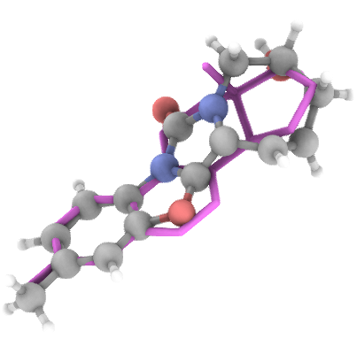
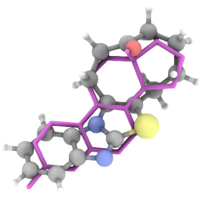
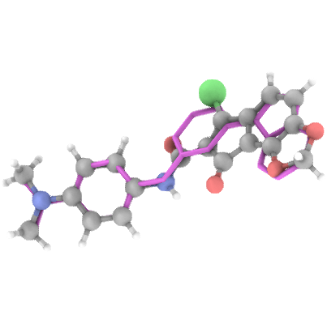
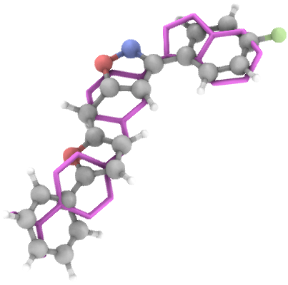

# ML Conformer Generator

**ML Conformer Generator** 
is a tool for shape-constrained molecule generation using an Equivariant Diffusion Model (EDM)
and a Graph Convolutional Network (GCN). It is designed to generate 3D molecular conformations
that are both chemically valid and spatially aligned with a reference shape.

---
## Installation

Install the package:

`pip install mlconfgen`

Load the weights:

---

## 🐍 Python API

See interactive examples: `./python_api_demo.ipynb`

```python
from rdkit import Chem
from mlconfgen import MLConformerGenerator, evaluate_samples

model = MLConformerGenerator(diffusion_steps=100)

reference = Chem.MolFromMolFile('MOL_FILE_NAME.mol')

samples = model.generate_conformers(reference_conformer=reference, n_samples=20)

aligned_reference, std_samples = evaluate_samples(reference, samples)
```
---

## 🚀 Overview

This solution employs:

- **Equivariant Diffusion Model (EDM) [1](https://doi.org/10.48550/arXiv.2203.17003)**: For generating atom coordinates and types under a shape constraint.
- **Graph Convolutional Network (GCN) [2](https://doi.org/10.1039/D3DD00178D)**: For predicting atom adjacency matrices.
- **Deterministic Standardization Pipeline**: For refining and validating generated molecules.

---

## 🧠 Model Training

- Trained on **1.6 million** compounds from the **ChEMBL** database.
- Filtered to molecules with **15–39 heavy atoms**.
- Supported elements: `H, C, N, O, F, P, S, Cl, Br`.

---

## 🧪 Standardization Pipeline

The generated molecules are post-processed through the following steps:

- Largest Fragment picker
- Valence check
- Kekulization
- RDKit sanitization
- Constrained Geometry optimization via **MMFF94** Molecular Dynamics

---

## 📏 Evaluation Pipeline

Aligns and Evaluates shape similarity between generated molecules and a reference using
**Shape Tanimoto Similarity [3](https://doi.org/10.1007/978-94-017-1120-3_5 )** via Gaussian Molecular Volume overlap.

> Hydrogens are ignored in both reference and generated samples for this metric.

---

## 📊 Performance (100 Denoising Steps)

*Tested on 100,000 samples using 1,000 CCDC Virtual Screening [4](https://www.ccdc.cam.ac.uk/support-and-resources/downloads/) reference compounds.*

- ⏱ **Avg time to generate 50 valid samples**: 11.46 sec (NVIDIA H100)
- ⚡️ **Generation speed**: 4.18 valid molecules/sec
- 💾 **GPU memory (per generation thread)**: Up to 4.0 GB
- 📐 **Avg Shape Tanimoto Similarity**: 53.32%
- 🎯 **Max Shape Tanimoto Similarity**: 99.69%
- 🔬 **Avg Chemical Tanimoto Similarity (2-hop 2048-bit Morgan Fingerprints)**: 10.87%
- 🧬 **% Chemically novel (vs. training set)**: 99.84%
- ✔️ **% Valid molecules (post-standardization)**: 48%
- 🔁 **% Unique molecules in generated set**: 99.94%
- 📎 **Fréchet Fingerprint Distance (2-hop 2048-bit Morgan Fingerprints)**:  
  - To ChEMBL: 4.13  
  - To PubChem: 2.64  
  - To ZINC (250k): 4.95

---

## Generation Examples






## ONNX Inference:

Weights of the model in ONNX format are available at:
> 


```python
from mlconfgen import MLConformerGeneratorONNX
from rdkit import Chem

generator = MLConformerGeneratorONNX(diffusion_steps=100)
reference = Chem.MolFromMolFile('MOL_FILE_NAME.mol')
samples = generator.generate_conformers(reference_conformer=reference, n_samples=20)

```
Install ONNX GPU runtime (if needed):
`pip install onnxruntime-gpu`

---
## Export to ONNX

```python
from mlconfgen import MLConformerGenerator
from onnx_export import export_to_onnx

generator = MLConformerGenerator()
export_to_onnx(generator)
```
This compiles and saves the models to: `./`

## API Server
- Run `docker compose up -d --build`
- The api server should be available at http:/0.0.0.0:8000
- The Swagger documentation is available at http:/0.0.0.0:8000/docs
- Generation endpoint http:/0.0.0.0:8000/generate

### Request Schema
```
{
  "reference_mol": {
    "type": "string",
    "content": "string"
  },
  "n_samples": 0,
  "variance": 0
}
```
### Response Schema
```
{
  "results": {
    "aligned_reference": "string",
    "generated_molecules": [
        {
            "mol_block": "string",
            "shape_tanimoto": 0.1,
            "chemical_tanimoto": 0.1,
        }
    ]
  },
  "errors": "string"
}

```

## Frontend 

### Running
- To bring the app UI up:
```
cd ./frontend
streamlit run app_ui.py
```


### Development
- To switch 3D viewer (stspeck) to development set `_RELEASE=False` in `./frontend/stspeck/__init__.py`
- Go to ./frontend/speck/fronted and run `npm run start` after that dev speck will run on http://localhost:3001
- After that run streamlit app from ./frontend
```
cd ./frontend
streamlit run app_ui.py
```
- To build the 3D viewer go to ./frontend/speck/fronted and run `npm start build`
