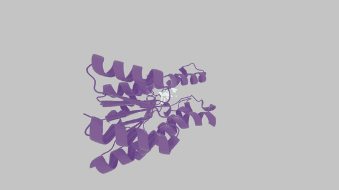

# Overview

## ML Conformer Generator

**ML Conformer Generator (MLConfGen)** is a tool for spatially-aware molecule generation with an Equivariant Diffusion Model (EDM) and a Graph Convolutional Network (GCN). It generates 3D molecular conformations that are both chemically valid and spatially similar to a reference shape.

---

> **Note:** The reference shape is described by the principal components of the molecule's **Moment of Inertia (MOI)** tensor. Any 3D point cloud that can be reduced to this descriptor — a reference ligand, a fragment, or a pocket volume — can be used to steer generation.

---

## Distributions

The project ships as two libraries that share the same trained weights:

| Library | Package | Backend | Scope |
|---|---|---|---|
| [Python](python/1_molecule_generation.md) | `mlconfgen` on PyPI | PyTorch or ONNX Runtime | Full pipeline: generation, fixed fragments, Inertial Fragment Matching, RL fine-tuning, ONNX export |
| [JavaScript](javascript/1_quick_start.md) | `mlconfgen` on npm | ONNX Runtime (Node or browser) | Generation, bond prediction, validity filtering, per-step animation |

---

## Key Features

**Shape-Guided Generation**: Generate molecules that conform to a 3D reference - a molecular conformer or an arbitrary MOI context.

**Fixed Fragments (Inpainting)**: Keep a substructure fixed and let the model complete the rest of the molecule in a geometrically consistent way, enabling scaffold hopping and fragment growing.

**Inertial Fragment Matching (IFM)**: Generate molecules fragment-by-fragment using the additivity of the MOI tensor, improving both shape similarity and chemical validity.

**Objective-Guided Generation**: Steer the generator towards higher-scoring molecules with reinforcement learning and a custom scoring function (REINVENT4 compatible).

**Torch-Free Inference**: Run the exported ONNX models with `onnxruntime` in Python, or with `onnxruntime-node` / `onnxruntime-web` in JavaScript.

**Lazy Weight Management**: Weights are downloaded from Hugging Face on first use and cached locally; full and distilled model variants are supported transparently.

---

## Citation

If you use **MLConfGen** in your work or research, please cite:

Denis Sapegin, Fedor Bakharev, Dmitry Krupenya, Azamat Gafurov, Konstantin Pildish, and Joseph C. Bear.
**Moment of inertia as a simple shape descriptor for diffusion-based shape-constrained molecular generation.**
Digital Discovery, 2025. DOI: [10.1039/D5DD00318K](https://doi.org/10.1039/D5DD00318K)

---

## Access & Licensing

- Source code: [github.com/Membrizard/ml_conformer_generator](https://github.com/Membrizard/ml_conformer_generator) — Apache 2.0
- Trained weights: [huggingface.co/Membrizard/ml_conformer_generator](https://huggingface.co/Membrizard/ml_conformer_generator) — Apache 2.0

> **Note:** The weights are **not** bundled with either package. They must be supplied as local files, or can be resolved from Hugging Face on first use. See [Model Weights](getting_started/2_model_weights.md).

## Support the Project

## Support the Project

If you find MLConfGen useful, a simple way to support further open-source work is to pick up the indie game that ships it on-device:

- [*Trust Me, It Binds*](https://store.steampowered.com/app/5119610/Trust_Me_It_Binds/) on Steam — a procedural deckbuilder built around MLConfGen molecule generation

More context: [Commercial Projects](projects/1_commercial.md).

